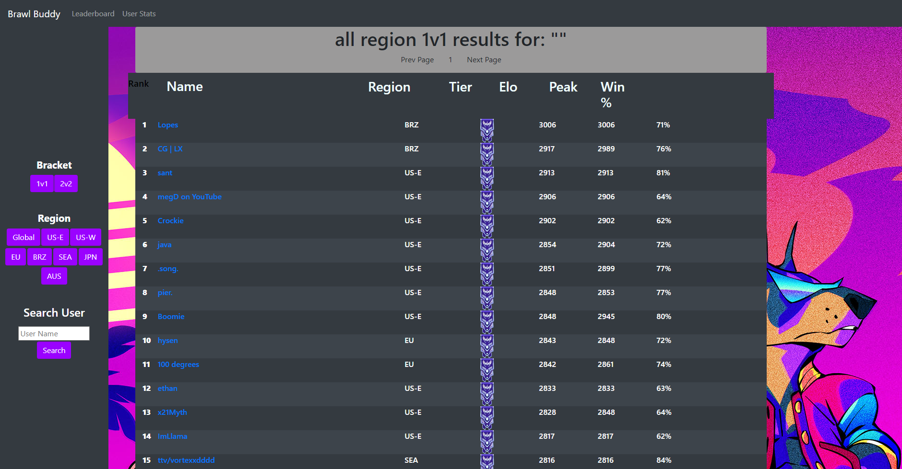

# BrawlBuddy
- Brawl Buddy is a stats and rank tracking tool for Brawlhalla. It includes
  - A **ranked table** displaying the top players. 
  - A **User Search tool** 
  - And a **Stream Buddy**.
- All data is pulled directly from the Brawlhalla API @ [dev.brawlhalla.com](https://dev.brawlhalla.com)

## Features
1. ### Ranked Table
 - 
2. ### User Search Tool
  - 
3. ### Stream Buddy
  - 
## Try it out
@ [brawl-buddy.herokuapp.com](https://brawl-buddy.herokuapp.com)

## Set up the dev environment  
  - Clone the repo
  - Add your API Key to a local .env file inside the root directory
  - cd BrawlBuddy && npm start  
  - Navigate to http://localhost:3000/
  - 🚀🚀
